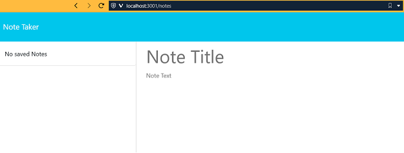
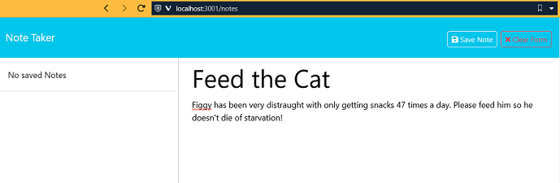
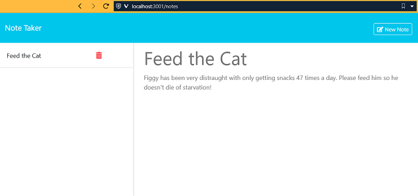
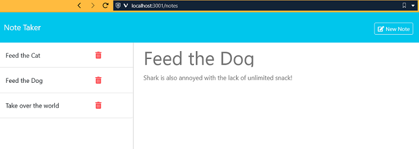

# note-taker

## Description

Note Taker application is a simple web app that allows a user to enter, display and delete notes.
The UI utilizes html and css while the backend utilizes Node with Express to serve the RESTful services to create, read, and delete note information from a flat file storage system. The initial application came with a non-functional UI in that there wasn't any backend to fulfill front-end requests. In order to make it work, Node/Express is used to implement the needed services. Additionally, the provided flat file contained an entry having no identifier which is problematic for CRUD operations. The file is now 'empty' until such time as a new note is added via the UI.

## Table of Contents

- [General Functionality](#general-functionality)
- [Screenshots](#screen-shots)
- [Installation](#installation)
- [Usage](#usage)
- [Credits](#credits)
- [License](#licensing)
- [Contributing](#contributing)

### General Functionality

The web application will display and allow a user to view any existing tasks entered, add a new task, and delete an existing task.

### Screen Shots

#### Initial Page Load

When the page initially loads there are no notes to display and a user can add a new note.

#### Note Create

The user can add a new note.

#### Note Saved

When the user saves the new note it is saved to the backend and displayed in the task list.

#### List Existing

When more notes are added they are accumulated and displayed in a list for view.

### Installation

1.  Install Node.js version 20.x or newer
2.  Clone https://github.com/ericroys-school/note-taker.git
3.  `cd` into the `note-taker` directory
4.  Run `npm i` to load all the project dependencies
5.  Run the program via `node server.js`

### Usage

If you are using from local installation then open the page at http://localhost:3001.
There is an existing deployment via Render @ https://note-taker-lm30.onrender.com which is free so if it connects slow the first time it's because Amazon has recycled the spot instance the Render used for deployment and needs to spin up a new instance. Have patience, be kind, grab more coffee.

### Credits

No kittens, puppies, armadillos, otter, or octopi were harmed in the making of this project.

### Licensing

As per always, this repo is licensed with [The Unlicense](http://choosealicense.com/licenses/unlicense) so feel free to do whatever. Share with your kids, dogs, neighbors, mail carrier, etc. Have a nice day!

### Contributing

Feel free to reach out via email @ eric.roys@gmail.com if you are interested in contributions to the project or have any kindly suggestions for improvements and/or enhancements. Tanks, Sherman!
